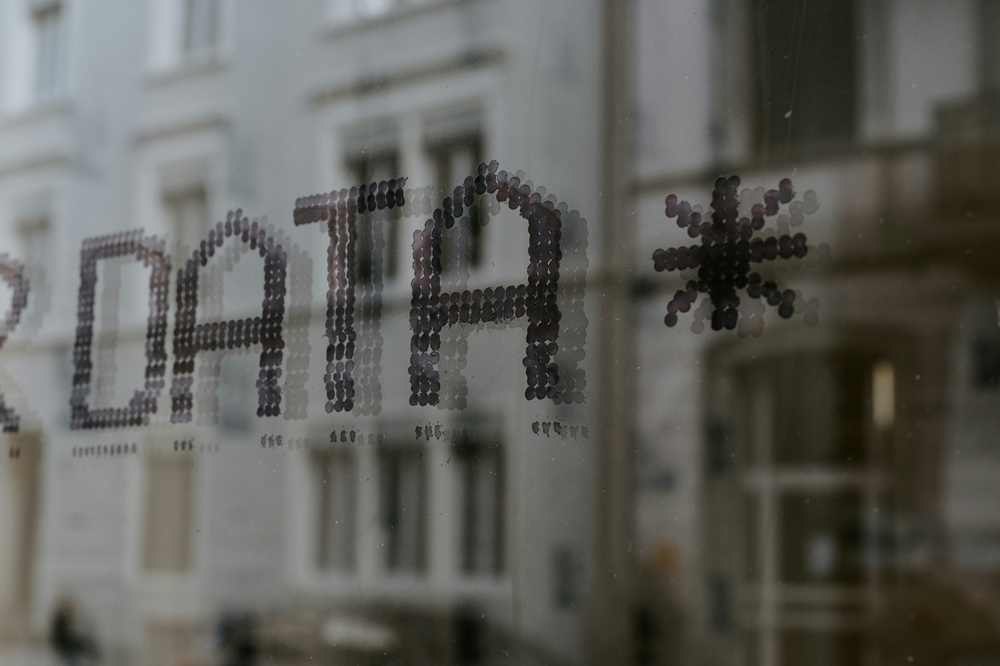

## Objective:

The aim of this assignment is to apply Bootstrap layout concepts to create a responsive webpage that outlines the services offered by a fictional company, "Tech Solutions." The page should be navigable, and informative, and maintain a professional appearance across various devices.

## Problem Statement:

Tech Solutions is looking to improve its online presence with a sleek service page that outlines what it offers in a clear and engaging way. The page needs to be responsive, adhering to mobile-first design principles, and should be accessible on all devices without compromising on usability or design.

**Task 1:** Design the Services Section Use the grid system to design a services section that showcases at least three services offered by Tech Solutions. Each service should have an icon/image, a title, and a short description.

**Expected Outcome:** A well-structured services section with equally spaced service cards that stack vertically on smaller screens and display in a row on larger screens.

```html
<body>
  <header>
    <div class="container">
      <h1 class=" text-center p-3 bg-body">Our Services</h1>
    </div>
  </header>
  <main>
    <div class="container">
      <div class="row">
        <div class="col-md-4 bg-primary text-center h-auto p-3">
          <h4 class="text-warning">Data Governance</h4>
          <article>
            Is your data protected and monitor? with our Data Governance...
          </article>
          
        </div>
        <div class="col-md-4 bg-success text-center h-auto p-3">
          <h4 class="text-warning">Cloud Services</h4>
          <article>With our cloud services package we...</article>
          
        </div>
        <div class="col-md-4 bg-warning text-center h-auto p-3">
          <h4>Firewall Security</h4>
          <article>
            We provide a a network security device that monitors and...
          </article>
          
        </div>
      </div>
    </div>
  </main>
</body>
```

**Task 2:** About Section with Sidebar Design an 'About Us' section that includes a main content area and a sidebar. The main content should take up two-thirds of the width, while the sidebar occupies one-third.

**Expected Outcome:** An 'About Us' section that maintains a two-column layout on medium to large screens and collapses into a single column on smaller screens, ensuring readability and accessibility.

```html
  <body>
    <header>
        <div>
            <div class="container">
                <h1 class=" text-center p-3 bg-body">About Us </h1>
        </div>
    </header>
        <main>
           <div class="container">
                <div class="row">
                    <div class="col-md-4 bg-danger text-light">
            <section>
                <h4 class="text-center fw-bold">Explore Our Solutions
                </h4>

                        <h6>Custom Software Development:</h6>
                        <ul>
                            <li>Tailored Applications</li>
                            <li>Enterprise Solutions</li>
                            <li>Mobile App Development</li>
                        </ul>

                        <h6>Contact Us:</h6>
                        <ul>
                            <li>Request a Quote</li>
                            <li>Schedule a Consultation </li>
                            <li>Customer Support</li>
                        </ul>

                        <h6>Resources</h6>
                        <ul>
                            <li>Case Studies</li>
                            <li>Blog</li>
                            <li>White Papers</li>
                            <li>Webinars</li>
                        </ul>

                        <h6> About Us</h6>
                        <ul>
                            <li>Careers</li>
                            <li>Privacy Policy</li>
                            <li>Terms of Service</li>
                        </ul>
            </section>
                    </div>
                    <div class="col-md-8 bg-warning">
            <article>
                <h4 class="text-center fw-bold"> Welcome to Reem Technologies...</h4>
                <br>

                    At Reem Technologies, we are dedicated to transforming your digital...
                    <ul>
                        <li>Data Governance: by offer tools to protecting, monitor your data.</li>
                        <li>Cloud Solutions: Harness the power of the cloud with our robust infrastructure and services, ensuring flexibility, security, and cost-effectiveness.</li>
                        <li>Cybersecurity Services: Protect your digital assets with our comprehensive cybersecurity solutions, designed to safeguard against evolving threats.
                        Why Choose Us?</li>
                        <li>Innovative Solutions: We stay ahead of the technology curve to deliver solutions that not only meet but exceed industry standards.</li>
                        <li>Client-Centric Approach: Your success is our priority. We work closely with you to understand your challenges and deliver personalized solutions.</li>
                        <li>Expert Team: Our skilled professionals bring a wealth of knowledge and experience, ensuring high-quality results and exceptional service.</li>
                        <li>End-to-End Support: From initial consultation to ongoing maintenance, we provide comprehensive support throughout the entire lifecycle of our solutions.</li>
                    </ul>

                    Partner with Reem Technologies to navigate the complexities of technology with confidence. Let us help you unlock new possibilities and achieve your business goals with innovative, reliable, and scalable tech solutions.
                    Contact Us Today to start your journey towards digital excellence.

            </article>
                    </div>
                </div>
           </div>
        </main>
```
**Task 3:** Create a Contact Form End with a contact form that uses Bootstrap form components. The form should include fields for the user's name, email, a selection of the service they are interested in, and a message box.

**Expected Outcome:** A responsive contact form that is well aligned and aesthetically pleasing, with intuitive input fields that provide a seamless user experience across all devices.

```html
 <body>
        <header class="container">
            <h1 class="text-center text-primary">Contact Us</h1>
        <main >
            <form >
                <div class="input-group mb-3">
                    <span class="input-group-text" id="inputGroup-sizing-default">UserName</span>
                    <input type="text" class="form-control" aria-label="Sizing example input" aria-describedby="inputGroup-sizing-default">
                  </div>
                  <div class="input-group mb-3">
                    <span class="input-group-text" id="inputGroup-sizing-default">Email Address</span>
                    <input type="text" class="form-control" aria-label="Sizing example input" aria-describedby="inputGroup-sizing-default">
                  </div>
                  <div class="input-group mb-3">
                    <button class="btn btn-outline-secondary dropdown-toggle" type="button" data-bs-toggle="dropdown" aria-expanded="false">Dropdown</button>
                    <ul class="dropdown-menu">
                      <li><a class="dropdown-item" href="#">Data Governance</a></li>
                      <li><a class="dropdown-item" href="#">Cybersecurity </a></li>
                      <li><a class="dropdown-item" href="#">Cloud Services here </a></li>
                    </ul>
                    <input type="text" class="form-control" aria-label="Text input with dropdown button">
                  </div>

                  <div class="form-floating fw-bold">
                    <textarea class="form-control" placeholder="Leave a comment here" id="floatingTextarea2" style="height: 100px"></textarea>
                    <label for="floatingTextarea2">Message Box</label>
                  </div>
               
              </form>
                <button type="submit" class="btn btn-primary">Submit</button>
        </main>
```